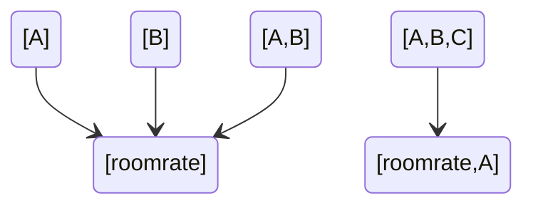

Let's say we want to predict house prices.

Then we need to find the factors that affect house prices (the laws of the world related to house prices).

Let's say A, B, C... Factors related to house prices

That means we can at least find A sentence that says: if (a sentence containing A or B or C, 
which is true) is true, then (a sentence containing "house price", which is true) is true

For the sake of illustration, (A sentence containing A or B or C, can judge the truth) I use {A,B,C}.
The world might have something like this:

{A} -> {room rate}
{B} -> {room rate}
{A,B} -> {room rate}
{A,B,C} -> {House price,A}
...

The above language can be represented by a "directed graph", such as:

So if we want to predict housing prices, we can understand that the achievement is the process of finding this logical pattern.