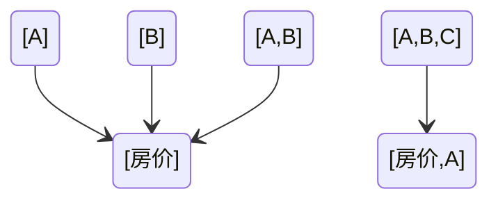

假设我们想要预测房价。

那我们需要找到影响房价的因素（这个世界与房价有关的规律）。
假设A，B，C...因素和房价有关

那么意味着我们至少能找到这样一句话：如果（一句包含A或者B或者C的，能判断真伪的话）是对的，那么（一句包含“房价”的能判断真伪的话）是对的

为了方便说明，（一句包含A或者B或者C的，能判断真伪的话）下面我用{A,B,C}表示。

这个世界可能存在类似如下的规律:

{A} -> {房价}   
{B} -> {房价}  
{A,B} -> {房价}  
{A,B,C} -> {房价,A}  
...

上述语言可以用一个“有向图”表示出来，如下图：

所有我们想要预测房价，可以理解成就是在找这个逻辑规律图的过程。