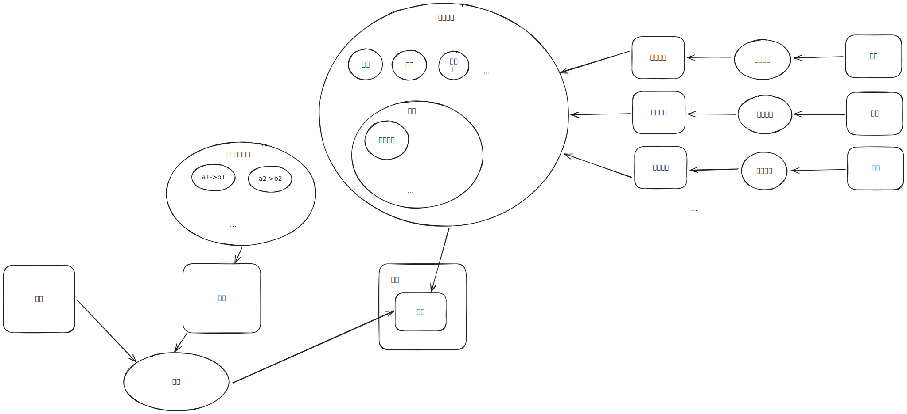

# 架构图

# 说明
我们在找寻自然世界的规律时，通常使用了 3 个能力：猜测、推理、验证。  
通常会先猜测出一个结论，然后想办法用推理的方式去证明这个结论是否正确。然后会用拿着这个结论和我们感受到的现实进行对照，如果不正确则说明我们对于某些规律的认知有错误，需要修改认知。修改认知的过程又和上述过程一致。  
上图中的因果关系数据的存储形式可能有好几种,比如神经网络某种角度来看,就等价于存储了很多映射关系数据.  
另外我们在推理的过程中,也会往因果关系池子里添加一些数据,但是这往往需要我们有用语言描述对象的能力,==主要是造句的能力==,还就是==理解句子的能力==.  

